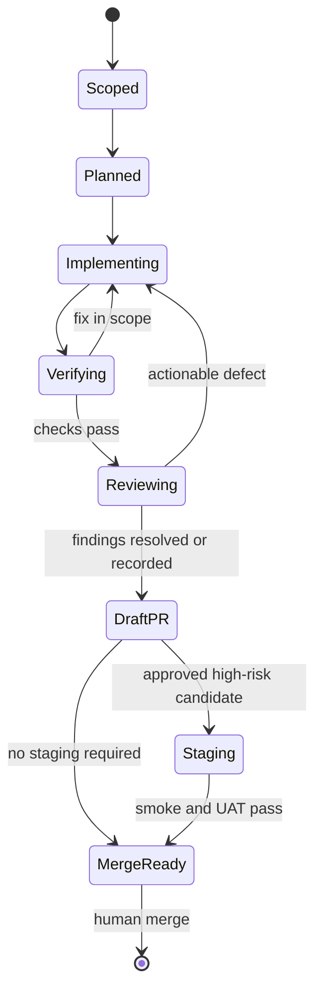

# Agentic Implementation Workflow

This document defines how implementation agents may build Topology Dojo roadmap
features without turning conversation history into the source of truth,
overlapping on the same code, or bypassing architecture and release controls.

It complements:

- [`DESIGN.md`](DESIGN.md) — product principles;
- [`ARCHITECTURE.md`](ARCHITECTURE.md) — current system boundaries;
- [`ROADMAP.md`](ROADMAP.md) — ordered product work;
- [`proposals/0002-shared-human-agent-workspace.md`](proposals/0002-shared-human-agent-workspace.md)
  — human/agent document collaboration;
- [`proposals/0003-adaptive-agent-authoring-profiles.md`](proposals/0003-adaptive-agent-authoring-profiles.md)
  — controlled preference learning;
- [`proposals/0004-isolated-staging-and-deployment-pipeline.md`](proposals/0004-isolated-staging-and-deployment-pipeline.md)
  — staging and deployment authority.

## Outcomes

An agentic implementation workflow must produce a reviewable repository state,
not merely a successful chat session. Every completed unit ends with:

- a bounded branch and commit history;
- an implementation/task packet stored in the PR or repository;
- tests and evidence proportional to risk;
- an adversarial review of architecture and user impact;
- explicit unresolved risks and follow-up work;
- a draft pull request that a human may inspect independently;
- no hidden production mutation.

## Authority model

| Action                                                     | Implementation agent | Human approval required                           |
| ---------------------------------------------------------- | -------------------- | ------------------------------------------------- |
| Read repository/docs and run local diagnostics             | Yes                  | No                                                |
| Create a feature branch/worktree                           | Yes                  | No                                                |
| Edit scoped source/docs/tests                              | Yes                  | No, after task scope is accepted                  |
| Install declared development dependencies                  | Yes                  | Only if policy/cost requires it                   |
| Commit and push a scoped branch                            | Yes                  | No, when explicitly authorized by the task        |
| Open/update a draft PR                                     | Yes                  | No, when explicitly authorized by the task        |
| Resolve review feedback in scope                           | Yes                  | Human selects ambiguous/product-changing feedback |
| Merge a PR                                                 | No                   | Yes                                               |
| Deploy to stable staging                                   | No by default        | Yes or protected workflow approval                |
| Deploy to production                                       | No                   | Yes, protected production approval                |
| Create/rotate secrets, OAuth Apps, or production resources | No                   | Yes                                               |
| Add/change a Durable Object migration                      | Plan and implement   | Explicit architecture and release approval        |
| Learn/broaden a user preference or MCP instruction         | Propose only         | Yes, under proposal 0003                          |

Terminal conditions such as “finish” or “do not stop” increase persistence, not
authority. An agent does not infer permission to deploy, merge, rotate secrets,
or modify production data.

## Roles

A workflow may use separate agents or sequential passes, but the roles remain
logically distinct.

| Role                 | Responsibility                                                                          | Must not do                                          |
| -------------------- | --------------------------------------------------------------------------------------- | ---------------------------------------------------- |
| Orchestrator         | Break work into dependency-ordered packets, enforce scope/ownership, collect evidence   | Write competing implementations of the same packet   |
| Implementer          | Make the smallest coherent source/test/doc change                                       | Expand product scope silently                        |
| Adversarial reviewer | Challenge architecture, failure modes, security, token/storage cost, and UX regressions | Rewrite the implementation before reporting findings |
| Verifier             | Run deterministic checks and inspect acceptance evidence                                | Mark a check passed without reproducible output      |
| Release operator     | Execute protected staging/production runbooks                                           | Deploy an unapproved SHA or bypass a failed gate     |

For high-risk work, the adversarial reviewer should not be the same active pass
that authored the implementation. For low-risk documentation work, a separate
self-review pass is sufficient.

## Unit of work: the implementation packet

No agent begins code changes from a one-line feature name. The orchestrator
creates a packet containing:

```markdown
# <Feature or fix>

## Outcome

What observable user/developer result must exist?

## Scope

Exact surfaces and expected files/components.

## Non-goals

What adjacent work is explicitly excluded?

## Architecture constraints

Relevant locked decisions, proposals, contracts, and compatibility rules.

## UX contract

Entry point, happy path, keyboard/undo/error/empty/loading/recovery behavior.

## Data and concurrency contract

State owner, operation boundaries, idempotency, conflicts, migrations.

## Risk class

Low / medium / high; security, data-loss, auth, migration, deployment flags.

## Acceptance criteria

Concrete and testable.

## Required validation

Unit, integration, Worker, browser, accessibility, performance, staging.

## Deployment impact

None / routine / binding or secret / migration-bearing.

## Authority

Whether commit, push, draft PR, staging, or any external action is authorized.
```

The packet lives in the issue/PR for normal work. Larger multi-PR initiatives
may add a numbered proposal or implementation document under `docs/`.

## Workflow state machine



An agent reports a blocker instead of jumping to a later state without its
required authority or evidence.

## Standard feature workflow

### 1. Orient

- Read `DESIGN.md`, the relevant architecture/proposal section, and only the
  roadmap slice needed for the packet.
- Inspect repository status before editing; preserve unrelated user changes.
- Identify current tests and runtime boundaries before proposing new ones.
- Confirm whether the work affects browser, headless API, MCP, Worker, storage,
  auth, or deployment surfaces.

### 2. Scope and decompose

- Create the implementation packet.
- Split work along contract boundaries that can be reviewed independently.
- Order shared model/API changes before UI and transport adapters.
- Keep one acceptance outcome per packet when practical.
- Mark files or subsystems likely to conflict with other active packets.

### 3. Assign ownership

- One agent owns writes to a packet branch at a time.
- Parallel agents receive disjoint file/subsystem scopes or read-only review
  tasks.
- Two agents do not modify the same file concurrently.
- Cross-packet dependencies merge through an explicit integration order.
- The orchestrator resolves ownership before implementation, not after a Git
  conflict appears.

### 4. Implement incrementally

- Change the shared document/model/API contract first.
- Add or update deterministic tests with the behavior.
- Add browser/MCP adapters only after the contract is stable.
- Preserve backward compatibility or document the migration boundary.
- Update user/operator documentation in the same packet.
- Commit coherent checkpoints; do not use commits as a scratchpad for secrets or
  generated build output.

### 5. Verify

Run the baseline repository gates:

```bash
npm run check:wrangler
npm run typecheck
npm test
npm run lint
npm run build
npm run test:e2e
```

Add targeted checks based on risk:

| Change                   | Additional evidence                                                       |
| ------------------------ | ------------------------------------------------------------------------- |
| Document/model operation | Round-trip, idempotency, invalid input, conflict tests                    |
| UI interaction           | Keyboard, pointer, undo/redo, empty/loading/error/recovery states         |
| MCP tool                 | Schema, runtime validation, compact result, authorization, tool-list docs |
| Worker route/auth        | Workerd/Miniflare integration and staging OAuth smoke                     |
| Storage/concurrency      | Atomicity, retry, size limit, stale revision, cross-owner isolation       |
| Durable Object migration | Full isolated staging deploy and forward-recovery exercise                |
| Deployment workflow      | Dry run plus protected staging execution                                  |

### 6. Adversarial review

The reviewer answers at least:

- Does this preserve the locked architecture decisions?
- Can the change lose, duplicate, corrupt, or expose user data?
- What happens on retry, reconnect, stale revision, partial failure, or timeout?
- Can an agent obtain more authority than the UI granted?
- Does the UI provide familiar keyboard, undo, selection, error, and recovery
  behavior expected from advanced diagram software?
- Did the change create a whole-document or unbounded-context token path?
- Are schemas/results larger than necessary for the task?
- Does the implementation introduce a second source of truth?
- Is the deployment and rollback model honest for this change?

Findings are either fixed in scope, explicitly accepted by the human, or filed
as follow-up work. They are not silently discarded.

### 7. Publish a draft PR

The draft PR includes:

- outcome and why it matters;
- architecture/data-flow summary;
- user interaction changes;
- files/subsystems affected;
- risk and compatibility notes;
- validation commands and results;
- screenshots or recordings for material UI behavior when available;
- staging/migration requirements;
- unresolved decisions and follow-ups.

The remote branch and commit are the durable handoff. Chat history is not.

### 8. Stage and release

- Low-risk changes may proceed from draft review to merge-ready without a live
  staging deploy.
- Auth, Worker routing, storage, concurrency, and migration changes require the
  staging runbook.
- Only the release operator executes protected deployment workflows.
- Production follows `DEPLOYMENT_RUNBOOK.md`; incidents follow `ROLLBACK.md`.

## Context and token discipline

Implementation agents should consume repository state as targeted evidence,
not repeatedly reload the whole project.

### Durable context sources, in order

1. Implementation packet and accepted proposal/ADR.
2. Current branch diff and recent commit messages.
3. Symbol/file searches for affected contracts.
4. Targeted source and test files.
5. Broader architecture documents only when a boundary is unclear.

### Rules

- Do not resend whole documents when a diff, revision, symbol, or bounded range
  answers the question.
- Do not place generated logs or complete test output into prompts by default;
  retain the failing section and summary.
- Read large schemas/tool catalogs on demand, not in every agent bootstrap.
- Persist accepted decisions in the repository or PR immediately.
- Reference commit SHAs and paths instead of narrating the entire session to the
  next agent.
- Summaries identify facts, decisions, risks, and open work; they do not copy
  large code blocks.
- If a task needs more than five unrelated repository areas, split the packet or
  justify why the boundary is truly atomic.

## Concurrency and integration

Git branches are the implementation concurrency boundary. They are not the
shared-document collaboration mechanism described in proposal 0002.

- One packet branch has one active writer.
- Parallel read-only reviewers may inspect the same branch.
- Parallel implementation branches declare expected shared-file conflicts.
- Shared foundational changes merge before dependent UI/tool branches.
- Rebase/update a dependent branch only after its dependency is stable.
- The integration owner runs the full suite after combining packets.
- Never resolve a semantic conflict by choosing “ours” or “theirs” without
  reconciling both acceptance contracts.

For a broad UI initiative, prefer this sequence:

1. shared model/capability contract;
2. deterministic operation and persistence tests;
3. editor interaction implementation;
4. MCP/browser transport exposure;
5. documentation and accessibility polish;
6. integrated adversarial review and UAT.

## Specialized workflow templates

### Diagram-software UX feature

- Benchmark the interaction contract against familiar Visio, Draw.io, and
  Lucidchart behavior.
- Specify pointer, keyboard, context-menu, toolbar, inspector, and undo/redo
  paths.
- Include discoverability, disabled state, selection preservation, zoom/pan,
  and error recovery.
- Keep the document/API capability available to agents where it changes the
  document; UI-only view state is explicitly identified.
- Add UAT language and a before/after interaction artifact.

### Architecture/refactor

- Preserve behavior with characterization tests before moving boundaries.
- State the old and new source of truth.
- Measure bundle, latency, storage, and context impact where relevant.
- Land adapters/migrations before deleting the old path.

### Migration-bearing change

- Requires a numbered proposal or explicit migration section in the packet.
- Includes compatibility and forward-recovery behavior.
- Cannot use a version preview as validation.
- Requires isolated full staging deploy, smoke, and human release approval.
- Must not merge until the deployment runbook identifies the exact migration
  sequence.

### Documentation-only change

- Validate links, terminology, Markdown formatting, and consistency with code.
- Do not mark an implementation finding resolved merely because a plan exists.
- May be committed/published without application tests when no executable file
  changes, but repository formatting checks still run.

## Learning and tool evolution boundary

Implementation agents may observe repeated friction and propose changes to MCP
tools, instructions, or authoring profiles. They may not autonomously teach the
system a durable preference or broaden a tool's authority.

- Stable MCP schemas remain code-reviewed.
- Candidate lessons include evidence, scope, counterexample, and token/runtime
  cost.
- User preferences follow the confirmation thresholds and retrieval budgets in
  proposal 0003.
- Product-wide guidance requires independent validation and versioned review.
- Bad outcomes are retained as evaluation cases, not copied into future
  instructions as unqualified rules.

## Required repository gates

A workflow is not complete until:

- [ ] the implementation packet is complete;
- [ ] scope and non-goals match the actual diff;
- [ ] architecture, tests, UI, and docs are updated together where applicable;
- [ ] deterministic checks pass;
- [ ] adversarial findings are resolved or recorded;
- [ ] the branch is committed and durably pushed;
- [ ] the draft PR contains validation and deployment impact;
- [ ] no secrets, build output, or environment credentials are committed;
- [ ] migration/staging approval is explicit when required;
- [ ] the human retains merge and production authority.

## Initial rollout

1. Use this workflow for the staging/deployment implementation in proposal 0004.
2. Use one small diagram-editor quality-of-life feature as the first standard
   feature packet.
3. Measure agent context consumed, iteration count, defects found in review,
   and human review time.
4. Refine the packet template after three independent features.
5. Automate only stable, repeatedly successful steps; keep product decisions and
   production authority human-controlled.
