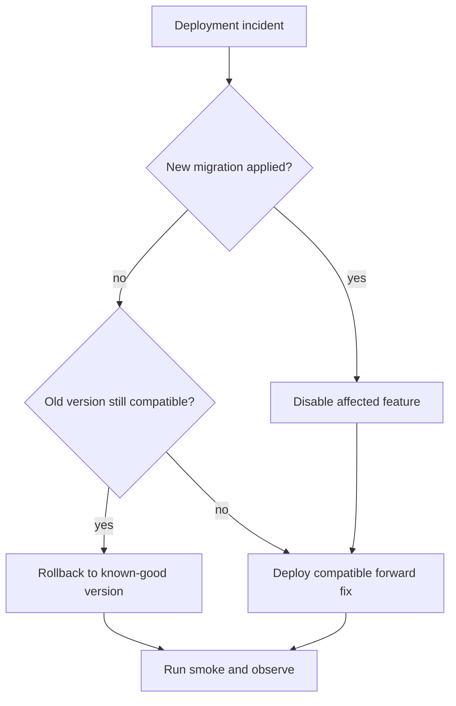

# Rollback and Forward-Recovery Runbook

Cloudflare Worker releases containing Durable Object migrations need a
different recovery model from ordinary stateless code releases. This runbook
defines the supported response for both.

See also [`DEPLOYMENT_RUNBOOK.md`](DEPLOYMENT_RUNBOOK.md) and
[`proposals/0004-isolated-staging-and-deployment-pipeline.md`](proposals/0004-isolated-staging-and-deployment-pipeline.md).

> **Note (2026-07-19, packet O3):** this document is migration-agnostic.
> Where a worked example names `v3`/`TopologyDocument` (the first migration
> this pipeline shipped), read it as "the migration boundary in question" —
> the identical procedure applies to `v4`/`AuthoringProfile` (flag
> `PROFILES_ENABLED`), `v5`/`AnalyticsLog` (flag `ANALYTICS_ENABLED`), and
> any future tag. The current highest applied tag is always the last entry
> of `wrangler.jsonc`'s `migrations` array. Per-migration bootstrap and
> activation gates live in `DEPLOYMENT_RUNBOOK.md`; the per-flag
> forward-disable/forward-enable procedures (values, expected degraded
> behavior, verification commands) live in `GAME_DAY.md`
> §"Forward-recovery reference".

## First principle

Do not cross a Durable Object migration boundary with a rollback. Once a
migration has been applied, recover by deploying compatible code forward. A
feature flag can stop user traffic from entering a new feature while preserving
the migrated namespace and code compatibility.

## Classify the release

| Release type                  | Example                                       | Primary recovery                                                       |
| ----------------------------- | --------------------------------------------- | ---------------------------------------------------------------------- |
| Stateless/assets only         | UI, renderer, documentation                   | Roll back to the last known-good compatible version                    |
| Durable Object code only      | Method implementation, no new migration tag   | Roll back only if stored data and RPC contracts remain compatible      |
| New migration not yet applied | Failed preview/version upload                 | Stop; deploy to staging properly or disable the preview job            |
| New migration applied         | `v3` creates `TopologyDocument`               | Disable feature and deploy a compatible forward fix                    |
| Data/security incident        | Incorrect workspace mutation or auth exposure | Contain, preserve evidence, revoke access, then forward repair/restore |

## Decision flow



## Immediate containment

1. Declare the incident and assign an incident owner.
2. Stop further deployments and staging promotions.
3. Record environment, source SHA, Cloudflare deployment/version id, migration
   tags, feature flags, first error time, and affected surfaces.
4. Preserve logs and user reports before changing the active deployment.
5. Determine whether the issue affects authentication, public shares,
   canonical workspace writes, private drafts, or only presentation.
6. If the workspace is involved, disable new workspace entry points using a
   compatible forward deployment. Do not delete the binding or class.
7. Revoke or rotate credentials immediately when exposure is suspected.

## Standard rollback: no migration boundary

Use this only when all of the following are true:

- the failed release did not apply a new migration;
- the target version is newer than or equal to the latest applied migration
  boundary;
- stored data written by the failed version is readable by the target version;
- Worker-to-Durable-Object RPC contracts remain compatible;
- the target version uses the current bindings and secrets.

Procedure:

1. Identify the last known-good compatible deployment.
2. Compare its migration tag, bindings, variables, and RPC/storage contracts
   with the active release.
3. Use the protected production recovery workflow or Cloudflare rollback
   control to select that exact version.
4. Record the actor, target version, reason, and source SHA.
5. Run the production smoke checklist.
6. Observe error rate, OAuth failures, and storage errors.
7. Open a follow-up issue for the original defect and the prevention action.

If compatibility cannot be proven, use forward recovery.

## Forward recovery: migration applied

The worked example below is `v3` (`TopologyDocument` /
`WORKSPACE_ENABLED`); for `v4` substitute `AuthoringProfile` /
`AUTHORING_PROFILE` / `PROFILES_ENABLED`, and for `v5` substitute
`AnalyticsLog` / `ANALYTICS` / `ANALYTICS_ENABLED` — the disable values and
verification commands for each flag are tabulated in `GAME_DAY.md`
§"Forward-recovery reference". For `v3`, the new namespace is initially
empty and legacy data moves only when the application performs lazy
migration. The namespace must remain declared even if the feature's traffic
is disabled.

Procedure:

1. Set `WORKSPACE_ENABLED=false` in a compatible candidate.
2. Preserve the `TopologyDocument` export, `TOPOLOGY_DOCUMENT` binding, and all
   migration history through `v3`.
3. Deploy the candidate forward using the protected production workflow.
4. Verify existing editor, login, private-draft MCP, and share paths.
5. Determine whether any users created or migrated workspaces while the feature
   was active.
6. If canonical data is suspect, stop writes and inspect affected document ids,
   revisions, operation ids, proposals, and page records before repair.
7. Build and validate the repair against a copy/fixture in staging.
8. Deploy the repair forward with the feature disabled.
9. Run targeted recovery verification.
10. Re-enable only after staging replay and production approval.

Never remove `v3`, rename `TopologyDocument`, or point its binding at another
script as an emergency shortcut.

## Data recovery principles

- Prefer idempotent semantic-operation replay over whole-document replacement.
- Preserve actor, operation id, base revision, and conflict evidence.
- Do not accept/reject pending proposals as part of an unrelated repair.
- Do not silently overwrite a user-edited canonical page with a legacy draft.
- Use the retained legacy source only after proving the canonical migration did
  not complete or is corrupt.
- Repair one owner/document coordinator at a time and record before/after
  revisions.
- Exercise SQLite-backed Durable Object point-in-time recovery in staging before
  depending on it in production.
- Export any recoverable user document before destructive repair.

## Authentication or secret incident

1. Disable affected entry points if possible without crossing the migration
   boundary.
2. Revoke the GitHub OAuth App secret or Cloudflare API token involved.
3. Rotate the credential independently in staging and production.
4. Invalidate sessions/grants when the credential or token scope warrants it.
5. Verify OAuth callback URLs and environment identity before reopening access.
6. Review access logs and public share activity for the exposure window.

## Failed smoke after a successful deploy

A Cloudflare success response is not a release success. If smoke fails:

- keep the deployment marked failed;
- do not promote the same SHA elsewhere;
- classify whether rollback is migration-safe;
- contain or recover using the appropriate path above;
- attach smoke output and deployment identifiers to the incident record.

## Recovery verification

At minimum verify:

- `/login` and the unauthenticated root redirect;
- OAuth metadata and browser sign-in/sign-out;
- a remote MCP read and private-draft persistence across sessions;
- public share read behavior;
- canonical workspace read/reconnect when the feature is enabled;
- no unexplained Durable Object exceptions or persistence failures;
- the active Worker reports the intended source SHA/environment.

## Staging game day

Superseded (2026-07-19, packet O2/O3): the full, repeatable drill —
staging-first, covering every current migration and feature flag, with
controlled synthetic faults, alert verification, production-safe
forward-disable exercises, and a reusable evidence record — is now
[`GAME_DAY.md`](GAME_DAY.md) with
[`GAME_DAY_EVIDENCE_TEMPLATE.md`](GAME_DAY_EVIDENCE_TEMPLATE.md). The
original 8-step exercise this section defined is contained within its
Phase 2/Phase 4 scenarios. Run it before relying on these recovery
procedures in an actual incident, and after any change to the deploy
pipeline or flag set.

## Incident record template

```markdown
### Topology Dojo deployment incident

- Environment:
- Incident owner:
- Start/end time:
- Active source SHA/deployment id:
- Latest applied migration:
- Feature flags:
- Impacted surfaces/users:
- Containment:
- Rollback compatibility decision:
- Recovery SHA/deployment id:
- Data repair performed:
- Smoke/observation result:
- Root cause:
- Prevention actions:
```
