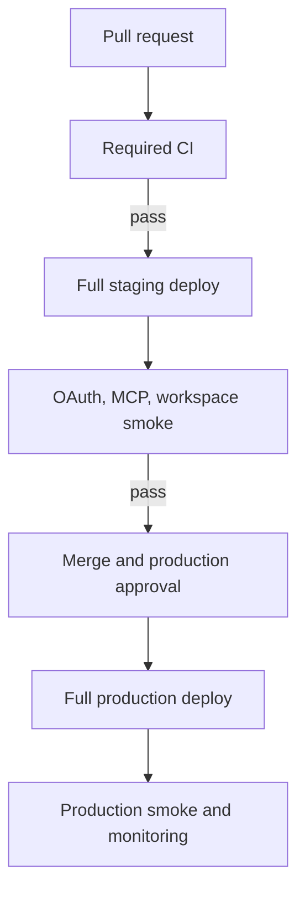

# Proposal 0004 — Isolated Staging and Durable Object Deployment Pipeline

**Status:** Implemented. The isolated staging environment, CI-gated deploy
pipeline, and feature-flag bootstrap pattern are all live; production has
completed the full activation sequence this proposal describes (see
`../DEPLOYMENT_RUNBOOK.md` and `../HANDOFF.md`). Status corrected 2026-07-19;
see `../DISCREPANCY_REGISTER.md` row 6 and the updated acceptance-criteria
checklist below.

**Captured:** 2026-07-12

**Addresses:** H7, M14, M15, and L1 in the launch-readiness findings

## Context

Topology Dojo is one Cloudflare Worker containing the browser application,
OAuth endpoints, MCP server, share API, and three Durable Object classes. The
current Cloudflare Workers Builds integration treats `main` as production and
uses `wrangler versions upload` for non-production branches.

That preview model is incompatible with a release that introduces a Durable
Object migration. The Phase 0 shared workspace adds migration `v3`:

```jsonc
{ "tag": "v3", "new_sqlite_classes": ["TopologyDocument"] }
```

Cloudflare rejects a version upload containing an unapplied Durable Object
migration with error `10211`. Migrations are atomic and must be applied by a
full `wrangler deploy`. Cloudflare also does not currently generate versioned
Preview URLs for Workers implementing Durable Objects.

The current repository has no isolated Wrangler environment. A non-production
deployment would therefore inherit the production Worker name and directly
reference the production OAuth and topology KV namespace ids. Treating that as
a preview would put production identity and user data in scope.

References:

- [Durable Object migrations](https://developers.cloudflare.com/durable-objects/reference/durable-objects-migrations/)
- [Durable Objects with versions and deployments](https://developers.cloudflare.com/workers/versions-and-deployments/gradual-deployments/with-durable-objects/)
- [Workers Builds configuration](https://developers.cloudflare.com/workers/ci-cd/builds/configuration/)
- [Wrangler environments for Durable Objects](https://developers.cloudflare.com/durable-objects/reference/environments/)
- [Worker Preview URL limitations](https://developers.cloudflare.com/workers/versions-and-deployments/preview-urls/#limitations)

## Goals

1. Give every migration-bearing release a production-isolated environment for
   browser, OAuth, MCP, KV, and Durable Object testing.
2. Make a successful CI run a hard prerequisite for any deployment.
3. Establish one authoritative production deployment path.
4. Apply Durable Object migrations deliberately with `wrangler deploy`, never
   accidentally through a preview/version upload.
5. Separate namespace creation from user-visible feature activation.
6. Provide smoke, rollback, and forward-recovery procedures that operators can
   execute under pressure.
7. Preserve a durable audit trail linking source commit, checks, deployment,
   migration tags, and smoke results.

## Non-goals

- Per-PR ephemeral Workers. Each would require isolated stateful resources,
  OAuth callbacks, secrets, lifecycle cleanup, and a full migration deploy.
- Sharing production OAuth, KV, or Durable Object state with staging.
- Using a global traffic split to canary a new Durable Object migration.
- Automatically mutating or deleting a Durable Object migration after it has
  been applied.
- Replacing local Miniflare/Workerd integration tests.

## Decisions

### 1. Stable staging replaces versioned PR previews

`topology-dojo-staging` is the single production-like preview surface. It is a
full Worker deployment with isolated state, not a version attached to the
production Worker.

Only one release candidate owns staging at a time. A deployment records the
source SHA in the workflow summary and in the staging smoke report. Newer
staging deploys cancel queued older deploys through a concurrency group.

### 2. Every stateful resource is environment-specific

| Resource                   | Staging                      | Production                      | May be shared? |
| -------------------------- | ---------------------------- | ------------------------------- | -------------- |
| Worker script              | `topology-dojo-staging`      | `topology-dojo`                 | No             |
| `OAUTH_KV`                 | Dedicated namespace          | Existing production namespace   | No             |
| `TOPOLOGY_KV`              | Dedicated namespace          | Existing production namespace   | No             |
| `TopologyMcp` objects      | Staging script namespace     | Production script namespace     | No             |
| `TopologyRegistry` objects | Staging script namespace     | Production script namespace     | No             |
| `TopologyDocument` objects | Staging script namespace     | Production script namespace     | No             |
| GitHub OAuth App           | Staging callback             | Production callback             | No             |
| OAuth client secret        | GitHub `staging` environment | GitHub `production` environment | No             |
| `PUBLIC_BASE_URL`          | Staging origin               | Production origin               | No             |
| Connector test data        | Synthetic/throwaway          | Production data                 | No             |

No staging Durable Object binding may set `script_name` to the production
Worker. Omitting that override lets the environment-specific Worker name own a
separate Durable Object namespace.

### 3. GitHub Actions becomes the deployment authority

Cloudflare Workers Builds must not remain a parallel path that can deploy the
same production Worker independently of repository checks.

| Event                      | Action                                                     | Deployment   |
| -------------------------- | ---------------------------------------------------------- | ------------ |
| Pull request               | Typecheck, tests, lint, build, Worker bundle validation    | None         |
| Manual staging request     | Repeat/verify checks, then `wrangler deploy --env staging` | Staging only |
| Push/merge to `main`       | Required checks, protected production approval             | Production   |
| Manual production recovery | Protected workflow using a named SHA                       | Production   |

Use GitHub Environments named `staging` and `production`. Store the scoped
Cloudflare API token and account id there. Production requires an approval and
must be limited to `main` or an explicitly selected recovery SHA.

Cloudflare Workers Builds should be disconnected after the Actions deployment
jobs are proven. At minimum, disable non-production branch builds immediately
so error `10211` is not reported as a failed application preview.

### 4. Migrations and feature activation are separate gates

Add a runtime feature flag such as `WORKSPACE_ENABLED` before the first
production migration deployment:

- staging: `true`;
- production namespace bootstrap: `false`;
- production activation after smoke and approval: `true`.

The bootstrap bundle must still export `TopologyDocument`, declare its binding,
and include migration `v3`; the flag only prevents browser/MCP traffic from
entering the new workspace routes. This makes the migration deploy operationally
inert while the new SQLite-backed namespace is created.

Migration `v3` creates a new namespace. It does not rewrite existing
`TopologyRegistry` data. User data moves only through the application-level
lazy migration after workspace activation.

### 5. Durable Object migration releases use forward recovery

A release that applies a new migration creates a rollback boundary. The
operator may roll back later non-migration code, but must not attempt to move to
a version from before the migration. Problems at or across that boundary are
repaired by deploying a compatible forward fix, normally with the new feature
disabled.

See [`../ROLLBACK.md`](../ROLLBACK.md).

## Target deployment flow



There is no `versions upload` step for a migration-bearing environment.

Feature implementation is expected to follow
[`../AGENTIC_IMPLEMENTATION_WORKFLOW.md`](../AGENTIC_IMPLEMENTATION_WORKFLOW.md).
Agents may build, test, commit, and publish an authorized draft branch, but the
staging and production transitions in this proposal remain protected human
release gates.

## Wrangler configuration shape

The implementation will add an environment similar to the following. Resource
ids and OAuth client values are placeholders and must never be copied from
production.

```jsonc
{
  "env": {
    "staging": {
      "vars": {
        "PUBLIC_BASE_URL": "https://topology-dojo-staging.<account>.workers.dev",
        "GITHUB_CLIENT_ID": "<staging-oauth-client-id>",
        "WORKSPACE_ENABLED": "true",
      },
      "kv_namespaces": [
        { "binding": "TOPOLOGY_KV", "id": "<staging-topology-kv-id>" },
        { "binding": "OAUTH_KV", "id": "<staging-oauth-kv-id>" },
      ],
      "durable_objects": {
        "bindings": [
          { "name": "MCP_OBJECT", "class_name": "TopologyMcp" },
          {
            "name": "TOPOLOGY_REGISTRY",
            "class_name": "TopologyRegistry",
          },
          {
            "name": "TOPOLOGY_DOCUMENT",
            "class_name": "TopologyDocument",
          },
        ],
      },
      "migrations": [
        { "tag": "v1", "new_sqlite_classes": ["TopologyMcp"] },
        { "tag": "v2", "new_sqlite_classes": ["TopologyRegistry"] },
        { "tag": "v3", "new_sqlite_classes": ["TopologyDocument"] },
      ],
    },
  },
}
```

Wrangler bindings and variables are not assumed to inherit into an environment.
The implementation must validate the effective configuration before the first
deploy and fail if a staging resource id equals a production resource id.

## Implementation phases

### Phase 0 — Stop the unsafe/broken preview path

- Disable Cloudflare Workers Builds for non-production branches on the
  production Worker.
- Keep PR #141 in draft until the staging path is available or an explicit
  exception is recorded.
- Leave migrations `v1` through `v3` intact.
- Do not replace the preview command with a production `wrangler deploy`.
- Treat GitHub CI as the PR gate while staging is bootstrapped.

**Exit:** PR branches no longer attempt `wrangler versions upload` against the
production Worker.

### Phase 1 — Provision isolated staging

- Create staging `OAUTH_KV` and `TOPOLOGY_KV` namespaces.
- Create a staging GitHub OAuth App with only the staging callback URL.
- Add `env.staging`, repeating all non-inheritable bindings, variables, and the
  full migration history.
- Store the staging OAuth secret in Cloudflare and the deployment credential in
  the protected GitHub `staging` environment.
- Confirm the staging Worker name and every binding before deploying.
- Run the first `wrangler deploy --env staging` to apply `v1` through `v3` to
  the staging script.

**Exit:** the staging app, browser auth, remote MCP, share storage, and all three
Durable Object namespaces work without production resources.

### Phase 2 — Add deployment workflows

- Pin the Node version used by CI and deployment.
- Preserve the PR `check` job as the required status.
- Add a staging workflow with `workflow_dispatch`, a staging GitHub
  Environment, and `concurrency: topology-dojo-staging`.
- Add a production job gated by CI, branch protection, and a production GitHub
  Environment approval.
- Upload the exact tested source SHA; do not rebuild an unrelated workspace.
- Emit the Worker deployment/version id, commit SHA, actor, migration tags, and
  smoke results to the workflow summary.
- Disconnect Cloudflare Workers Builds after both Actions paths are verified.
- Encode the agentic implementation packet, adversarial review, and evidence
  summary in the pull-request workflow without granting agents merge or deploy
  authority.

**Exit:** there is exactly one path capable of changing production, and it
cannot run before required checks pass.

### Phase 3 — Add smoke and health coverage

- Add an unauthenticated `/healthz` endpoint that proves the Worker is running
  without exposing secrets or state.
- Add a deeper authenticated readiness check for required bindings.
- Automate the safe HTTP smoke subset in the deployment workflow.
- Keep browser OAuth, MCP OAuth, proposal acceptance, lease enforcement, and
  lazy migration as staging-only manual/E2E checks until safely automated.
- Configure alerts for Worker error rate and failed deployment workflows.

**Exit:** a deployment is not successful until its smoke suite passes; an
operator receives an actionable signal when it does not.

### Phase 4 — Bootstrap production migration `v3`

- Confirm Phase 0 through Phase 3 exit criteria.
- Deploy the production candidate with `WORKSPACE_ENABLED=false` using the
  protected full deployment path.
- Verify the active deployment and non-workspace smoke suite.
- Confirm migration `v3` is applied and `TopologyDocument` is bound.
- Do not create user workspaces during the bootstrap.

**Exit:** production owns the new, empty Durable Object namespace while all
workspace entry points remain disabled.

### Phase 5 — Activate the shared workspace

- Deploy/enable `WORKSPACE_ENABLED=true` after staging UAT approval.
- Run the full workspace smoke: create, hand off, propose, accept/reject,
  grant/revoke lease, reconnect, and lazy-migrate a disposable legacy draft.
- Watch Worker error rate, Durable Object errors, OAuth failures, and proposal
  conflicts during the observation window.
- Disable the feature and forward-deploy if a stop condition is met.

**Exit:** production workspace flows pass and remain within operational
thresholds for the agreed observation period.

### Phase 6 — Retire transitional controls

- Keep the staging environment and protected deployment workflows permanent.
- Revisit the feature flag only after at least one routine non-migration
  release and a rollback exercise.
- Document every future migration with its compatibility window, recovery
  direction, and explicit staging evidence.
- Consider ephemeral environments only if Cloudflare adds suitable stateful
  preview isolation and the operational cost is justified.

## Acceptance criteria

_Checked off 2026-07-19 against verified current state — see
`../DISCREPANCY_REGISTER.md` row 6. Two items remain genuinely open and are
tracked as `../IMPLEMENTATION_PLAN.md` packets O2/O3._

- [x] Production non-production branch builds are disabled. (Operator O9,
      2026-07-17 — Workers Builds Git integration disconnected.)
- [x] Staging and production share no KV ids, OAuth clients/secrets, Worker
      names, or Durable Object namespaces. (`scripts/check-wrangler-env.mjs`,
      enforced in CI.)
- [x] No deployment script or workflow uses `wrangler versions upload` for a
      Worker containing an unapplied migration. (`deploy-production.yml` uses
      `wrangler deploy`.)
- [x] PR checks run typecheck, 262+ tests, lint, production build, and Worker
      bundle validation. (Now 723 tests; `ci.yml`.)
- [x] Staging is deployed only after the required check succeeds.
      (`deploy-staging.yml`.)
- [x] Production is deployed only from protected `main` with approval.
      (`deploy-production.yml`'s `guard` job + `production` GitHub Environment.)
- [x] Migration `v3` is applied and tested in staging before production.
      (Operator O10, 2026-07-17 — and `v4`/`v5` have since followed the same
      pattern.)
- [x] Production namespace bootstrap occurs with workspace entry points
      disabled. (Operator O10 — `workspace_disabled` bootstrap smoke green.)
- [x] Automated smoke results are attached to each deployment.
      (`scripts/smoke.mjs`, deployment-run summaries.)
- [ ] The rollback/forward-recovery exercise has been performed once in
      staging **against the current `v3`–`v5` reality** — a `v4` drill was
      performed (`docs/HANDOFF.md` "Gate A"), but the full `ROLLBACK.md`
      "Staging game day" checklist has not been executed and recorded as a
      single dated exercise. Tracked as `../IMPLEMENTATION_PLAN.md` packet O2.
- [ ] H7, M14, M15, and L1 have evidence-backed closure notes in the findings
      register. H7, M14, and L1 are now closed; **M15 remains "substantially
      addressed"** — Cloudflare alerting and the game day above are the
      remaining gap. Tracked as `../IMPLEMENTATION_PLAN.md` packets O1/O2.

## Risks and controls

| Risk                                                | Control                                                                                 |
| --------------------------------------------------- | --------------------------------------------------------------------------------------- |
| A PR overwrites another candidate in stable staging | One active candidate, workflow concurrency, SHA displayed in the UI/run summary         |
| Staging accidentally binds production state         | Explicit ids, automated equality check, separate OAuth App, no production `script_name` |
| Migration deploy also exposes unfinished UI         | `WORKSPACE_ENABLED=false` namespace bootstrap                                           |
| A red build reaches production                      | One Actions path with `needs: check`, branch protection, environment approval           |
| Migration prevents rollback                         | Forward-compatible code, feature disable, forward-recovery runbook                      |
| Manual laptop deploy bypasses controls              | Repoint/remove production npm deploy script and scope tokens during implementation      |
| Staging becomes permanent but unmaintained          | Nightly smoke, ownership, cost review, documented resource inventory                    |

## Required decisions before implementation

1. Confirm GitHub Actions as the sole production deploy authority rather than
   retaining Workers Builds.
2. Choose the staging hostname and create the corresponding GitHub OAuth App.
3. Name the required production approver(s) and staging owner.
4. Set the observation window and error-rate stop threshold for workspace
   activation.
5. Decide whether staging deploys are manual-only or also follow a dedicated
   `staging` branch.
