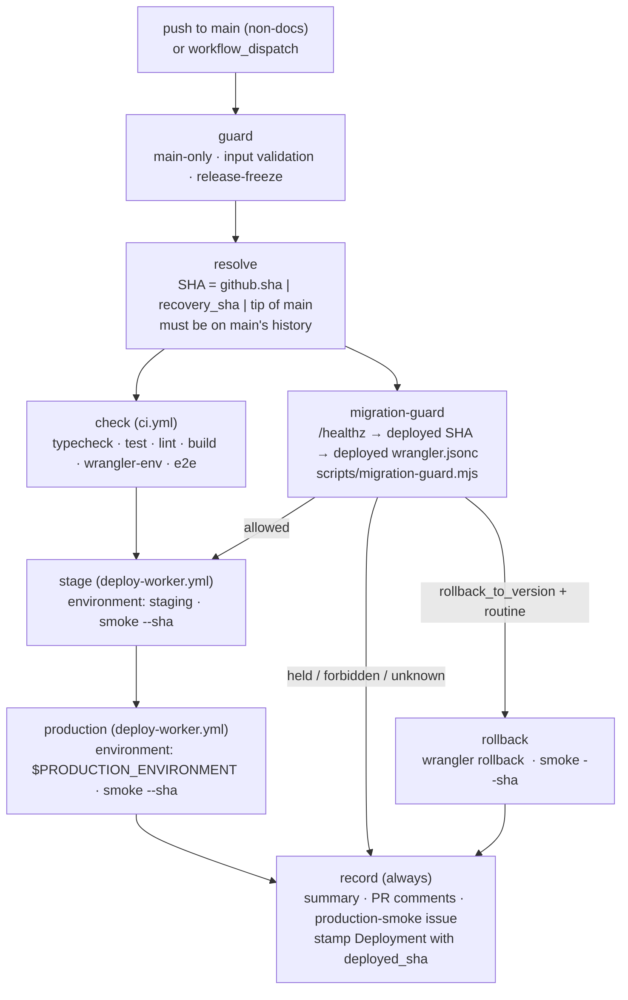

# Proposal 0007 — Merge Is the Release

**Status:** Implemented in the repository (workflows, guard script, tests,
docs) — pending the owner's GitHub settings changes listed under "GitHub
settings checklist" before the first unattended release. Supersedes the
production half of proposal 0004 decision 3 and closes the drift recorded in
`../DISCREPANCY_REGISTER.md` ("Follow-up — 2026-10-09").

**Captured:** 2026-10-10

**Owner's decision (verbatim):** "for phase 2 go ahead… let's get it more
automated. Merge is deploy."

## Context

Proposal 0004 decision 3 intended "push/merge to `main` → required checks,
protected production approval → production". The implementation drifted to a
manual `workflow_dispatch` of `deploy-production.yml` plus a `production`
GitHub Environment required-reviewer click. With one owner, that click only
ever approved the dispatcher's own dispatch; the implementation agent acts
under the owner's GitHub identity, so it gated nothing while adding a
desktop-only step. The reviewers were removed on 2026-10-09 (phase 1); the
dispatch itself became "the human release decision".

Phase 2 removes the dispatch too. The human release decision becomes the
thing it already was in practice: **merging a pull request into `main`**.
Everything after the merge is mechanical, except the one thing that must
never be mechanical — applying a Durable Object migration to production.

## Decisions

### 1. Merge is the release

`release.yml` runs on every `push` to `main` that touches anything but
`docs/**` or `*.md`. On the merge SHA it runs the reusable CI set
(`ci.yml`: typecheck, Vitest, lint, build, `check-wrangler-env`, Playwright),
rehearses the exact build on staging, and deploys it to production with the
same `--sha`-asserting smoke as before. A failed job anywhere leaves
production untouched (or, after a failed production smoke, marked failed
with the previous SHA named as the recovery target). There is no approval
click and no dispatch for a routine release.

### 2. Staging is rehearsed on every release

The candidate reaches production only after the identical commit has been
deployed to `topology-dojo-staging` and passed smoke there. This makes
staging a mandatory rehearsal rather than an optional UAT surface. Manual
`deploy-staging.yml` dispatches (any ref — UAT of feature branches stays
legitimate) share the `topology-dojo-staging` concurrency group and now
**queue** instead of cancelling, so a UAT dispatch can no longer cancel a
release's rehearsal mid-flight. Whoever lands last owns staging; UAT reports
must quote the staging `/healthz` SHA.

### 3. Durable Object migrations need a typed acknowledgement

`scripts/migration-guard.mjs` compares the top-level `migrations` array of
the config production serves (the commit `GET /healthz` reports) with the
candidate's, entry-wise with `deepEqual`:

| Class       | Meaning                                                                                         | Unattended?                                                                        |
| ----------- | ----------------------------------------------------------------------------------------------- | ---------------------------------------------------------------------------------- |
| `routine`   | arrays identical                                                                                | yes                                                                                |
| `migration` | production's array is a strict prefix of the candidate's                                        | **no** — held until a dispatch with `apply_migration_tag` = the new tag(s) exactly |
| `forbidden` | anything else: a tag removed, renamed, reordered, re-classed, or reused                         | never — not even to staging; the guard names the first differing index             |
| `unknown`   | the deployed config was assumed (`assume_deployed_sha`) rather than read from a live `/healthz` | **no** — needs `assume_deployed_sha` **and** a matching `apply_migration_tag`      |

A merge that appends `v6` therefore produces a red `release.yml` run
("HELD at migration-guard") and a comment on the merged PR saying exactly
what to dispatch. The ack is typed, not clicked: a human writes `v6` (or
`v6,v7`) into the dispatch form. The provenance rule exists because a guard
that trusts an operator-supplied "what production runs" value is only as
good as that value: when `/healthz` is unreadable, the operator must state
both the assumed SHA and the migration consequence they accept.

### 4. No unattended rollback

Nothing in the pipeline runs `wrangler rollback` on its own. A stateless
rollback is an explicit dispatch with `rollback_to_version` (the Cloudflare
version id from the known-good run's summary) plus `recovery_sha` (that
build's SHA, same summary). The guard classifies `recovery_sha` against
production and the rollback job only runs when the class is `routine` —
i.e. that build's migrations equal production's — so a rollback can never
cross a migration boundary. Migration cases stay forward-only
(`../ROLLBACK.md`): a `release-freeze` issue, then a `recovery_sha` deploy
of a compatible forward build.

### 5. One production environment, one-line split

Both routine and migration releases deploy through the GitHub Environment
named by the single workflow-level constant `PRODUCTION_ENVIRONMENT` in
`release.yml` (`production`: deployment branches `main` only, no reviewers).
A private instance that wants a human click on migration releases points
that constant at a reviewer-gated environment (e.g. `production-migration`)
— one line, no job-graph change. The `resolve` job copies the constant into
an output because reusable-workflow calls cannot read `env`.

### 6. Agent identity is the owner's — a documented limitation

The implementation agent operates with the owner's GitHub identity and can
therefore merge PRs and dispatch workflows exactly as the owner can. No
GitHub setting distinguishes the two. The control is procedural and
recorded in `../HANDOFF.md` and `../AGENTIC_IMPLEMENTATION_WORKFLOW.md`: an
agent never merges to `main` and never dispatches `release.yml` except on an
explicit, quoted chat instruction. Branch protection with no bypass
(including admins) makes "merge" require a PR with green `CI / check` and
`CI / e2e`, which is the only technical gate that applies equally to both.

### 7. Freeze is an issue, not a setting

A release freeze is an open issue labelled `release-freeze` authored by the
repository owner. `guard` refuses pushes and no-input dispatches while one
exists; a dispatch carrying `recovery_sha`, `apply_migration_tag` or
`rollback_to_version` is the incident response and bypasses it (with a
warning in the log). Closing the issue resumes releases.

### 8. The record is the Deployments API

Every `environment:` job creates a GitHub Deployment automatically.
`release.yml`'s `record` job stamps that deployment with a status whose
description carries `deployed_sha=<sha>` (the auto-created deployment's
`sha` is the run's commit, which differs for recovery and rollback deploys)
and the Cloudflare version id. `production-verify.yml` (now hourly) reads
the newest successful production deployment and asserts `/healthz` serves
its SHA; a `/healthz` SHA that belongs to a deployment with a non-success
status is reported as an "unrecorded pipeline deploy" (a run died after
`wrangler deploy`), distinct from an out-of-band deploy. PR and issue
comments are for humans only: this is a public repository and comments are
forgeable, so nothing reads them back.

## Job graph

`deploy-worker.yml` (`workflow_call`) is the one deploy implementation:
checkout the exact SHA → `npm ci` → build → `check-wrangler-env.mjs` → read
migration tags → `wrangler deploy --env="<env>" --var GIT_SHA:<sha>` →
capture `Current Version ID` → `smoke.mjs <url> --sha <sha> --wait-live 180
--json`. `deploy-staging.yml` calls it for manual UAT deploys;
`deploy-production.yml` is deleted (its inputs live on `release.yml`).

### Dispatch inputs (`release.yml`)

| Input                       | Use                                                                                                                              |
| --------------------------- | -------------------------------------------------------------------------------------------------------------------------------- |
| `recovery_sha`              | Forward recovery of a main-history commit; with `rollback_to_version`, the SHA of the build being restored. Bypasses the freeze. |
| `apply_migration_tag`       | Typed ack of a migration release: the exact new tag(s), comma-joined. `none` acknowledges an assumed-routine release.            |
| `expect_workspace_disabled` | Production smoke asserts the 503 `workspace_disabled` contract (bootstrap deploys only).                                         |
| `assume_deployed_sha`       | Only when `/healthz` is unreadable. Forces `release_class: unknown`; requires a matching `apply_migration_tag`.                  |
| `rollback_to_version`       | Cloudflare version id to roll back to. Requires `recovery_sha`; refused unless that build's migrations equal production's.       |
| `reason`                    | Free text, recorded in the summary and the rollback message.                                                                     |

Every input is read through `env:`; none is interpolated into a script.

## GitHub settings checklist (owner action)

The workflows are safe to merge before these are set, but the design is not
complete until they are:

- [ ] **Branch protection on `main`**: require a pull request before
      merging; required status checks `CI / check` and `CI / e2e` (strict:
      branch must be up to date); **no bypass, including administrators**
      ("Do not allow bypassing the above settings"). This is the only
      technical gate that binds the agent (owner identity) as well as the
      owner.
- [ ] **Environment `production`**: deployment branches = `main` only (as
      today); no required reviewers (as of 2026-10-09); secrets
      `CLOUDFLARE_API_TOKEN` (production-scoped) and `CLOUDFLARE_ACCOUNT_ID`.
- [ ] **Environment `staging`**: no required reviewers; secrets
      `CLOUDFLARE_API_TOKEN` scoped to the **staging** Worker only (see
      risks) and `CLOUDFLARE_ACCOUNT_ID`.
- [ ] **Repository → General**: "Allow auto-merge" **disabled** (verified
      off on 2026-10-10) — a merge must be a deliberate click, never a
      queued one.
- [ ] **Actions → General**: workflow permissions "Read repository contents
      and packages permissions" (read-only; the workflows request `issues`,
      `pull-requests` and `deployments` write per job); "Require approval
      for all external contributors" for fork PRs.
- [ ] **Labels**: `release-freeze` (new) and `production-smoke` (exists).
- [ ] After the first green unattended release: confirm the hourly
      `production-verify` run reports "deployed SHA matches the record".

## Acceptance criteria

- [ ] A non-docs merge to `main` with an unchanged `migrations` array
      results, with no human action, in: green CI on the merge SHA, a staging
      deploy + smoke of that SHA, a production deploy + smoke of that SHA, a
      PR comment "Released to production in run …", and a stamped production
      Deployment.
- [ ] A docs-only merge triggers no release.
- [ ] A merge that appends a migration tag produces a red run held at
      `migration-guard`, with the PR comment naming the exact
      `apply_migration_tag` to dispatch; staging and production are untouched.
      The subsequent dispatch with that ack releases it.
- [ ] A candidate whose array is not a strict extension of production's is
      refused at `migration-guard` with the first differing index named, and
      reaches neither staging nor production.
- [ ] A dispatch from any ref other than `main` fails at `guard` before
      checkout, whatever its inputs.
- [ ] A push while an owner-authored `release-freeze` issue is open fails at
      `guard`; a `recovery_sha` dispatch during the freeze proceeds with a
      warning.
- [ ] `rollback_to_version` + `recovery_sha` restores the named version,
      smoke passes with that SHA, and the same dispatch is refused when that
      build's migrations differ from production's.
- [ ] `production-verify` (hourly) passes against the stamped record after
      a release, a recovery deploy and a rollback; a mismatched `/healthz`
      files the deduplicated `production-smoke` issue with the right
      classification.
- [ ] `src/testing/migration-guard.test.ts` pins every class/ack/provenance
      branch; `node scripts/migration-guard.mjs` against the real
      `wrangler.jsonc` vs itself reports `routine`.

## Risks

| Risk                                                                | Control / mitigation                                                                                                                                                                                                                                                                                                                                          |
| ------------------------------------------------------------------- | ------------------------------------------------------------------------------------------------------------------------------------------------------------------------------------------------------------------------------------------------------------------------------------------------------------------------------------------------------------- |
| The staging token can address the production Worker                 | `deploy-staging.yml` deploys any ref with the `staging` environment's token. Mitigation is operator action: scope that Cloudflare API token to the `topology-dojo-staging` script (Workers Scripts edit on that script only, or a separate account/zone). Until then, the `--env staging` + `check-wrangler-env` pairing is the only thing keeping it honest. |
| Agent and owner share one identity                                  | Decision 6: branch protection with no bypass + the procedural rules in `HANDOFF.md`. Accepted, documented limitation.                                                                                                                                                                                                                                         |
| A bad merge reaches production with no human in the loop            | CI + staging rehearsal + `--sha` smoke on production; hourly `production-verify`; forward recovery by `recovery_sha`; stateless `rollback_to_version`. Single-owner, low-traffic deployment: the blast radius is the owner's own sessions.                                                                                                                    |
| Environment-scoped secrets and reusable workflows                   | `deploy-worker.yml` is called with `secrets: inherit`: environment secrets resolve only inside the job that declares the environment (the called job), so an explicit `secrets:` map evaluated in the environment-less caller would be empty. The call is intra-repo at the same commit, so nothing is widened.                                               |
| Queued releases: GitHub keeps one pending run per concurrency group | A burst of merges leaves the newest run queued (it contains the older commits) and cancels older pending ones; the cancelled run's PRs are covered by the newer run's range comments.                                                                                                                                                                         |
| `/healthz` unreadable at release time                               | `migration-guard` fails closed; the operator re-dispatches with `assume_deployed_sha` and the matching `apply_migration_tag` (decision 3, provenance rule).                                                                                                                                                                                                   |
| Release run dies after `wrangler deploy` (runner loss)              | The Deployment stays non-success; the hourly verify reports "unrecorded pipeline deploy" rather than a false out-of-band alarm; the operator re-runs or dispatches `recovery_sha`.                                                                                                                                                                            |
| Comment spam / forged comments                                      | Comments are informational only; nothing parses them (decision 8).                                                                                                                                                                                                                                                                                            |
